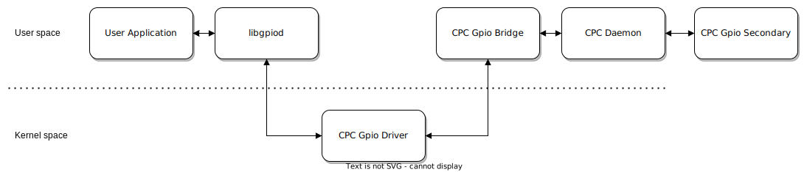

# CPC GPIO Expander

Enables the expansion of general purpose I/O's on a Linux system via a Silicon Labs microcontroller.

## Table of Contents
- [Diagram](#diagram)
- [Features](#features)
- [Installation](#installation)
  - [Components](#components)
  - [Bootstrap](#bootstrap)
- [Usage](#usage)
  - [Interaction](#interaction)
  - [Modification](#modification)
- [Limitations](#limitations)
  - [Interrupts](#interrupts)
- [Considerations](#considerations)
  - [Set value feedback](#set-value-feedback)
  - [Initialization sequence](#initialization-sequence)

## Diagram

## Features
* Native implementation using the Linux GPIO kernel/userspace subsystem
* Compatible with 3rd party libraries ([C](https://git.kernel.org/pub/scm/libs/libgpiod/libgpiod.git/tree/README), [Rust](https://crates.io/crates/gpiod), [Python](https://pypi.org/project/gpiod/) and more)
* Supported operations:
  * Get a value
  * Set a value
  * Input configurations
    * Bias: No-Pull
    * Bias: Pull-Up
    * Bias: Pull-Down
  * Output configurations
    * Drive: Open-Drain, Bias: No-Pull
    * Drive: Open-Drain, Bias: Pull-Up
    * Drive: Open-Source, Bias: No-Pull
    * Drive: Open-Source, Bias: Pull-Down
    * Drive: Push-Pull, Bias: No-Pull

## Installation

### Components
The following components must be installed:

- [CPC Daemon](https://github.com/SiliconLabs/cpc-daemon)
- [CPC GPIO Secondary](./secondary/README.md)
- [CPC GPIO Driver](./driver/README.md)
- [CPC GPIO Bridge](./bridge/README.md)

### Bootstrap
The recommended order to launch everything is:

1. Load the CPC GPIO Driver
2. Flash the CPC GPIO Secondary
3. Run the CPC Daemon
4. Run the CPC GPIO Bridge

## Usage

### Interaction
The CPC Secondary is seen as a GPIO chip (`/dev/gpiochip*`). 
To get started, you can use userspace tools such as [gpiod](https://git.kernel.org/pub/scm/libs/libgpiod/libgpiod.git/tree/README) to interact with the GPIO's. 
If you wish to do this programatically, there are 3rd party libraries available as highlighted in the [features](#features) section.

### Modification
Should you want to expose more (or fewer) GPIO's, you must reflash the CPC GPIO Secondary and run the CPC GPIO Bridge again. 
There should never be a need to unload/load the CPC GPIO Driver as it handles deinitialization/initialization dynamically.

## Limitations

### Interrupts
Interrupts are currently not implemented. One must use polling mechanisms as a workaround.

## Considerations

### Set value feedback
Set value operations don't propagate an error to the caller, however, they are logged by the CPC GPIO Driver/Bridge. It is therefore recommended to follow up a Set value operation with a Get value operation to be sure the value is set.

This is normally not a problem unless the CPC Daemon/GPIO Bridge process is terminated and/or the CPC GPIO Secondary has restarted.

### Initialization sequence 
Users must release previously held CPC GPIO's back to the kernel before starting the CPC GPIO Bridge again. Not releasing GPIO's will prevent the CPC GPIO Driver from deinitializing the current set of GPIO's and thus prevent the CPC GPIO Bridge from progressing in its initialization sequence. 

This may come off as a surprise compared to `sysfs` but this is by design with the new GPIO subsystem.